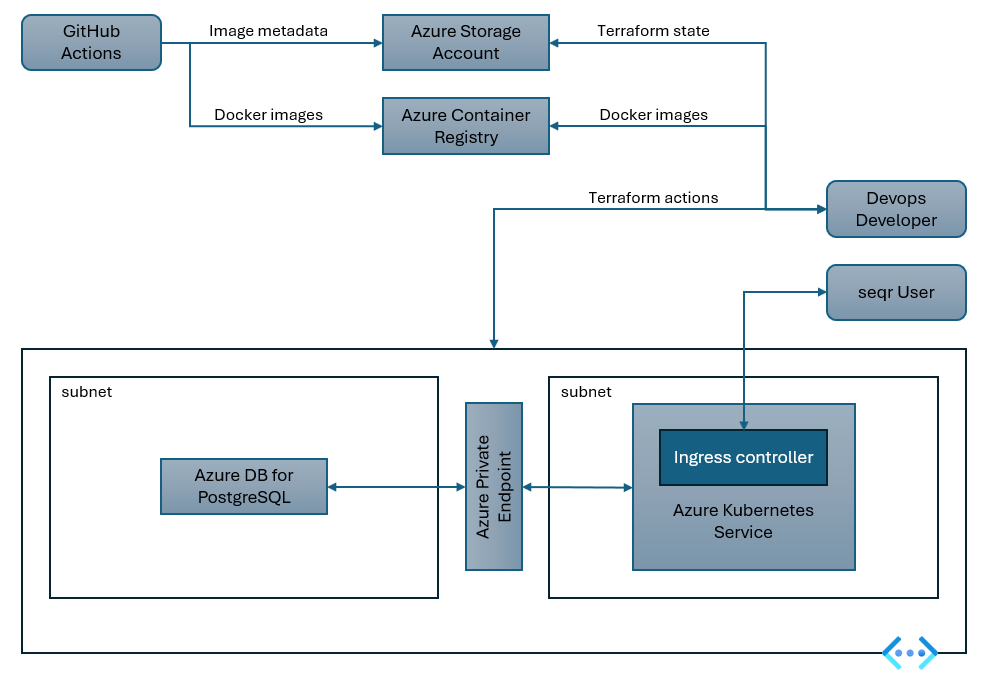

# seqr-deploy

Infrastructure and deployment code for a running SEQR Kubernetes cluster on Azure

## Introduction

This repository contains the code for deploying a [seqr](https://seqr.broadinstitute.org) instance on Azure. It is intended to be used with the [Azure CLI](https://docs.microsoft.com/en-us/cli/azure/install-azure-cli?view=azure-cli-latest) and [Terraform](https://www.terraform.io/).

The instructions below have been tested on Windows Subsystem for Linux (WSL2) running Ubuntu 20.04 LTS. If you observe issues or differences on other platforms, please submit an issue.

## Deployment Overview

[seqr](https://seqr.broadinstitute.org/) is a web application for analyzing genomic data. It is composed of a number of services, each of which is deployed as a containerized application. The services are deployed to a Kubernetes cluster running on Azure. The Kubernetes cluster is managed by Azure Kubernetes Service (AKS). The Kubernetes cluster is deployed and configured using Terraform.

This repository does not contain the source code for the services, instead it references the seqr source via git submodule.

The following image shows the high-level architecture of the deployment:



Deployment of a new environment is handled in the following steps:

- Deploy the Azure resources using terraform (via `terraform apply`)
- Generate the docker images for the relevant services (via GitHub Actions)
- Deploy the seqr Kubernetes services and objects (again via `terraform apply`)

Each of these steps is discussed in more detail below.

### Github deployment model

This repository leverages [GitHub deployments](https://docs.github.com/en/actions/deployment/about-deployments) to support multiple deployments from within this repository. Different deployments are bound to branches within the repository, and have the opportunity to reference different branches of the core seqr sources by modifying the git submodule references.

This repository is currently configured such that management of all deployments is available to collaborators of the repository. For organizations that wish to restrict access to their deployments it is suggested to fork this repository and manage deployments from the fork.

### Security considerations

The majority of the infrastructure deployed by this repository is placed in an Azure Virtual Network (VNet). This includes the Kubernetes cluster and the Azure Database for PostgreSQL (Postgres). The only resource within the VNet that is exposed to the public internet is the Kubernetes Ingress Controller, which is configured to only allow traffic from a set of whitelisted CIDR blocks (detailed below). This prevents unauthorized access to the seqr application home page while allowing intended users the ability to access the application.

Authentication to the seqr application is handled by Azure Active Directory (AAD). It is configured such that only users within the AAD tenant associated with the deployment are able to access the application. Authorization for the application is handled by the application itself, which grants project-level access with varying roles.

Both the Azure Container Registry and Azure Storage account associated with the deployment are necessarily placed outside of the VNet as they must be accessible to GitHub to permit execution of the GitHub actions that build/push docker images associated with the application and store the metadata necessary for deployment. Both authentication and authorization for these actions is handled by AAD.

The infrastructure deployed by this repository is configured to comply with [CIS Microsoft Azure Foundations Benchmark v1.4.0](https://learn.microsoft.com/en-us/azure/governance/policy/samples/cis-azure-1-4-0) with the following exceptions.

- *Ensure Default Network Access Rule for Storage Accounts is Set to Deny* - This is necessary to permit GitHub actions to access the storage account associated with the deployment
- *Ensure 'Enforce SSL connection' is set to 'ENABLED' for PostgreSQL Database Server* - This control is not necessary as the Postgres server is not exposed to the public internet and TLS termination is handled by the Kubernetes cluster's ingress controller.

While the above measures are intended to minimize risk of unwanted access to the application or associated resource, deployments based on this repository are intended for development purposes only and should not be used for production workloads. Further security review may be necessary before deploying to production.

## Making a new Deployment

The following sections walk you through the process of making a new deployment within this repository.

### Pre-requisites

In order to complete subsequent steps, the following requirements must be met:

- (GitHub) You should be a collaborator on this repository
- (Azure) You should have an Azure subscription
- (Azure) You need to be assigned the Azure AD role `Application Administrator`
- (Deployment Environment) You should have a Linux environment with the Azure CLI ([instructions](https://learn.microsoft.com/en-us/cli/azure/install-azure-cli-linux?pivots=apt)) and Terraform ([instructions](https://developer.hashicorp.com/terraform/tutorials/aws-get-started/install-cli)) installed
- (Deployment Environment) Login to the Azure CLI using `az login`, note the GUID for your tenant and subscription

### Deployment

1. Determine a `$DEPLOYMENT_NAME` for this deployment. This will name be used throughout the deployment process as a prefix for various Azure resources.

    > ***NOTE:***  The deployment name must be unique within the global Azure naming scope, and must contain between 8 and 16 characters of only lowercase letters and numbers.

1. Clone this repository

    ```bash
    git clone https://github.com/gregsmi/cpg-deploy.git
    ```

1. Create a new branch for your deployment.

    ```bash
    git checkout -b env-$(DEPLOYMENT_NAME)
    ```

1. Rename `deployment.template.env` to `deployment.env`. Populate `deployment.env` with the `AZURE_TENANT_ID` and `AZURE_SUBSCRIPTION_ID` that you collected above. Additionally, populate `deployment.env` with values for `DEPLOYMENT_NAME` (`$(DEPLOYMENT_NAME)`) and `REGION` (e.g. `eastus`). This file will make information about your deployment available to Terraform and GitHub Actions.

1. Run `terraform-init.sh -c` from within the `terraform` directory to configure terraform to manage this deployment. This script will first ensure that you are logged in to the correct Azure tenant and subscription with `az login` and then confirm the correct Azure resources exist to store the terraform state, specifically a Resource Group (RG) that will eventually house your seqr deployment, a Storage Account (SA) within that RG, and a Container within that SA. After configuring terraform to use that SA to hold terraform state, it will then write out `terraform.tfvars` with the values derived from `deployment.env`. This file will be used by terraform to configure your deployment.

    > ***NOTE:***  The script is idempotent and safe to run multiple times. The `-c` argument allows creation of the necessary resources if they do not already exist, so it only needs to be used the first time `terraform-init.sh` is run. Without arguments, the script will only perform the login and check that the resources are correctly configured (erroring if not).

    ```bash
    cd terraform
    ./terraform-init.sh -c
    ```

1. Create `config.auto.tfvars.json` in the `terraform` directory to house other configuration variables relevant to your deployment, this includes an allow list of CIDRs that will be permitted to access the seqr application and a list of data storage accounts that TODO. The format for this file is as follows:

    ```json
        {
            "whitelisted_cidr_map": {
                "Contoso Org": "1.2.0.0/16,3.4.0.0/16",
                "Person 1:": "5.6.7.8"
            },
            "data_storage_accounts":  { 
                "firstsa": "firstsa-rg",
                "secondsa": "secondsa-rg"
            }
        }    
    ```

    Where `whitelisted_cidr_map` is a map of person/org => CIDR block list that will be permitted access by the `nginx` reverse proxy to the public facing IP address that is created for the seqr application. Additionally, `data_storage_accounts` is a map of SA / RG pairs that contain data that will be accessed by the seqr-loading-pipeline. The storage account keys for these SA's will be read from Azure and written as Kubernetes secrets made available to seqr-loader cluster jobs.

    > ***NOTE:***  If the `whitelisted_cidr_map` is left empty, no whitelist will be in effect and all IPs will be accepted by the reverse proxy.

1. Run an initial pass of `terraform apply`. This will create and configure all of the Azure resources associated with the deployment. It will also apply an initial set of configurations to the kubernetes cluster. At this point, however, terraform will not have all of the necessary information to create the kubernetes objects associated with the seqr application itself; we will revisit this later.

1. Commit changes on your branch and publish to remote.

1. [Create a github environment](https://docs.github.com/en/actions/deployment/targeting-different-environments/using-environments-for-deployment#creating-an-environment) named `env-$(DEPLOYMENT_NAME)`, restricted to your branch. Permissions to do this are restricted to the repository owner. If you are not the repository owner, please request that they do this for you.

1. Run `terraform output -json AZURE_CREDENTIALS` and put the result in a new [GitHub Environment Action secret](https://docs.github.com/en/actions/security-guides/encrypted-secrets#creating-encrypted-secrets-for-a-repository) named `AZURE_CREDENTIALS`. Again, this can only be done by the repository owner.

1. Trigger the `Build latest SEQR docker images` GitHub Action on your branch. This will build the latest docker images for seqr and seqr-loader and push them to the Azure Container Registry (ACR) associated with your deployment. This will take approximately 15 minutes to complete.

1. Once this has completed successfully, re-run `terraform apply` to complete the deployment. This will create the kubernetes objects associated with the seqr application. After confirming the changes to be made, deployment will take approximately five minutes.

> ***NOTE:***  Any time you update the source code for this deployment you will need to re-run the final two steps here to redeploy the containers.

### Destruction

1. Run `terraform destroy`. This must be run from the terraform directory.

1. After this operation completes, using either `az cli` or the Azure portal delete the resource group `$(DEPLOYMENT_NAME)-rg` and the storage account contained within.

1. Remove the GitHub environment named `env-$(DEPLOYMENT_NAME)`. Permissions to do this are restricted to the repository owner. If you are not the repository owner, please request that they do this for you.

### Troubleshooting

1. Deploying the seqr environment in your Azure Subscription requires that a number of providers be registered on the subscription. At the very least, this includes `Microsoft.Storage` and probably also `Microsoft.Compute`. You may encounter errors during `terraform apply` if these providers are not registered. If you encounter such an error, you can register the provider using the Azure CLI:

    ```bash
    az provider register --namespace Microsoft.Storage
    az provider register --namespace Microsoft.Compute
    ```
